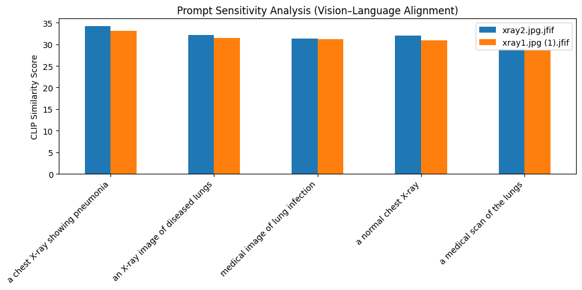

# Vision–Language Prompt Sensitivity Prototype

## Overview

This repository contains a small research prototype exploring how vision–language models respond to changes in text prompt phrasing. The goal of this exploratory work is to better understand the semantic alignment behavior of pretrained multimodal models, particularly CLIP, when interpreting subtle wording differences.

This work was inspired by research on **vision–language representations**, **multimodal alignment**, and **interpretability**, and is intended to support learning and discussion in these areas.

---

## Motivation

Recent advances in vision–language models have enabled joint understanding of images and natural language. However, model behavior can be sensitive to seemingly small changes in textual input. Understanding this sensitivity is important for:

- designing more robust multimodal systems,
- improving representation learning,
- and supporting interpretability in real-world applications.

This prototype examines how prompt phrasing affects similarity scores generated by CLIP, highlighting the impact of semantic variation.

---

## Input

**Images**  
- A small set of sample images (e.g., chest X-rays or general images)  
- Uploaded via Colab interface

**Text Prompts**  
A list of descriptive phrases that vary in wording but refer to similar semantic content. Example prompts:

- “a chest X-ray showing pneumonia”  
- “an X-ray image of diseased lungs”  
- “medical image of lung infection”  
- “a normal chest X-ray”  
- “a medical scan of the lungs”

---

## Methods

1. Load a pretrained **CLIP (Vision–Language) model**.
2. Encode images and text prompts into a shared semantic space.
3. Compute cosine similarity scores between image and text embeddings.
4. Compare how different prompt phrasing affects alignment scores.
5. Visualize and interpret results to observe sensitivity to prompt variation.

---

## Results

The output of this prototype includes:

- A **similarity score table** that ranks text prompts by similarity for each image.
- A **bar chart visualization** showing prompt sensitivity for each image.
- A short list of observations about how semantic phrasing influences vision–language alignment.

These outputs help highlight how prompt design choices can meaningfully change the model’s interpretation of an image.

---

## Usage

1. Open the provided Colab notebook:  
   https://colab.research.google.com/drive/18dn_Af01pr5KxGXwZQMbPyLX8a295lZ2

2. Upload one or more images in the designated cell.

3. Run all cells in sequence to compute and visualize prompt sensitivity.

4. Modify or extend text prompts to observe additional alignment behavior.

---

## Observations (Sample)

- CLIP similarity scores vary significantly with changes in wording, even for semantically related phrases.
- Domain-specific terminology (e.g., medical terms) behaves differently from more general descriptions.
- Prompt phrasing can unintentionally bias alignment scores toward or away from expected interpretations.

These observations suggest that careful prompt design is critical when applying vision–language models to sensitive or domain-specific tasks.

---

## Limitations

- This prototype uses a small number of images and prompts for exploratory purposes.
- No quantitative evaluation metric (e.g., statistical significance) is computed.
- The approach does not evaluate downstream tasks such as classification or retrieval.

---

## Future Work

Possible extensions include:

- Expanding the image dataset to cover diverse domains.
- Systematic evaluation of different prompt phrasing strategies.
- Integration of additional multimodal models for comparison.
- Incorporating human evaluation of alignment quality.

---

## Acknowledgments

This prototype was developed to deepen understanding of multimodal representation learning and to support ongoing research exploration in vision–language interpretation.

---

## Notes

- The image shown at the top of this file references `xray1.jpg.jfif` from the repository. If you prefer the file to be named `OUTCOME.png`, you can rename or copy the image locally.

---

## Quick rename/copy command (PowerShell)

```powershell
Copy-Item -Path "xray1.jpg.jfif" -Destination "OUTCOME.png"
```
